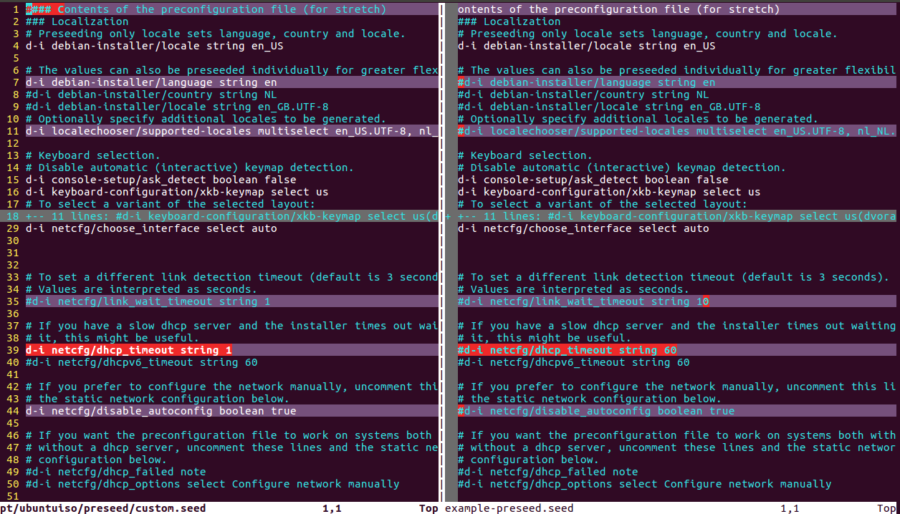
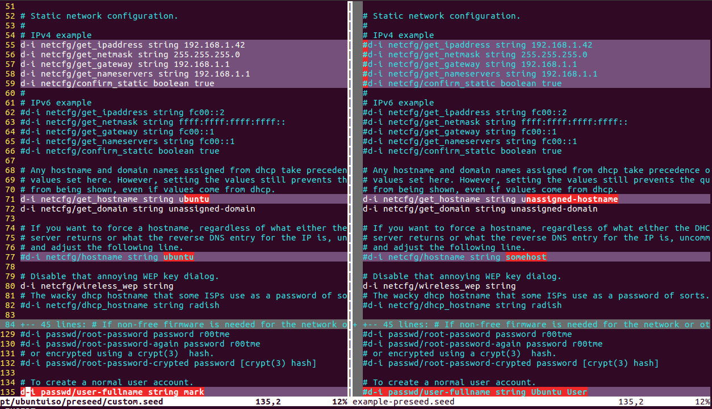
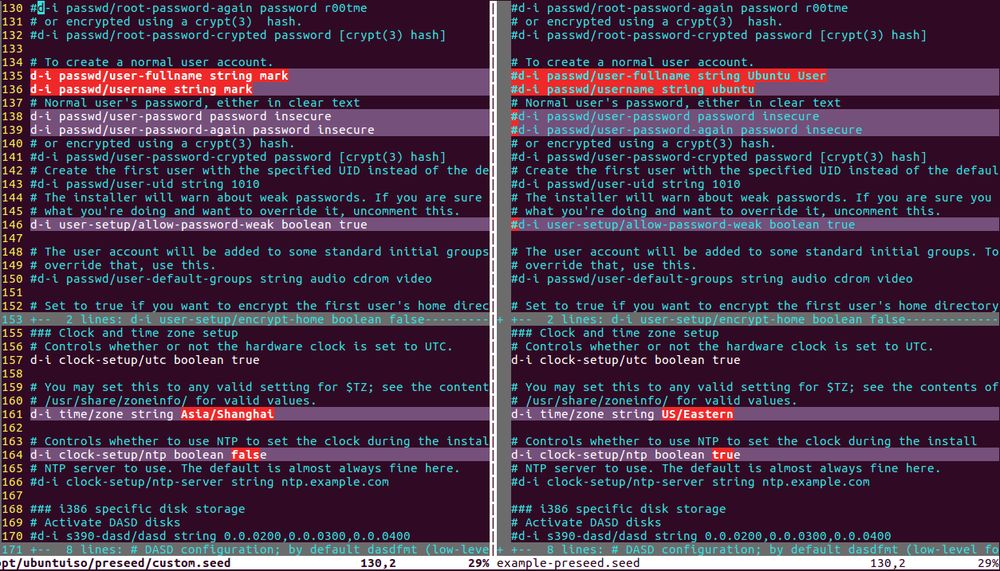
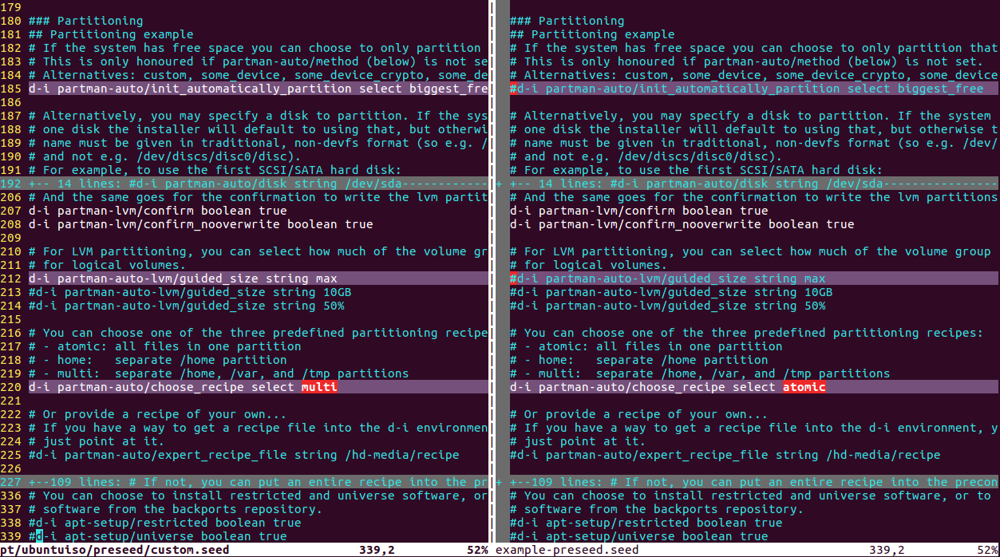
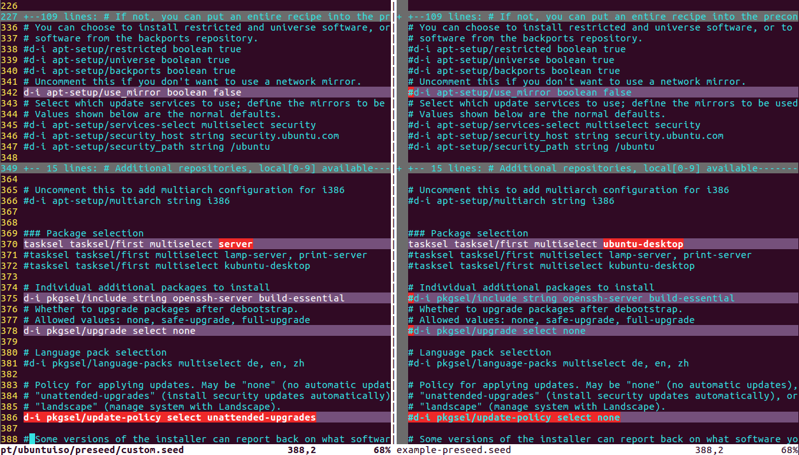
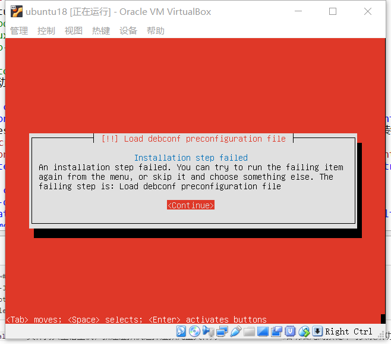

# chap0x01 无人值守Linux安装镜像制作

----------

## 实验要求
* 无人值守Linux安装镜像制作
## 实验环境
* Ubuntu 16.04.1 Desktop 64bit
## 实验过程
### step1 下载镜像文件
* 在虚拟机中下载`Ubuntu-server`版镜像文件
	* <pre>mark@mark:~$ sudo -s
		root@mark:~# wget http://sec.cuc.edu.cn/ftp/iso/ubuntu-18.04.1-server-amd64.iso</pre>
* 将下载好的镜像文件文件挂载
	* <pre>root@mark:~# mkdir -p /opt/ubuntuiso
		root@mark:~# mount -o loop ubuntu-18.04.1-server-amd64.iso /mnt/iso</pre>
* 将相关文件复制到其他目录
	* <pre>root@mark:~# root@mark:~# mkdir -p /opt/ubuntuiso
		root@mark:~#cp -rT /mnt/iso /opt/ubuntuiso</pre>
### step2 根据官方提供的[example-preseed.txt](https://help.ubuntu.com/lts/installation-guide/example-preseed.txt)自制custom.seed
* 设置安装时语言及地区选择，设置网络相关操作
	* 
* 手动配置网络相关参数，设置主机名
	* 
* 设置普通用户的用户名及登陆密码，允许弱密码，设置时区为上海
	* 
* 设置磁盘分区及逻辑卷大小
	* 
* 禁用apt网络镜像，选择预安装软件，采用`unattended-upgrades`更新策略
	* 
### step3 应用自制的custom.seed
* 设置引导语句以使用`custom.seed`文件
	* <pre>label autoinstall
	   menu label ^Auto Install Ubuntu Server
	   kernel /install/vmlinuz
	   append  file=/cdrom/preseed/custom.seed debian-installer/locale=en_US console-setup/layoutcode=us keyboard-configuration/layoutcode=us console-setup/ask_detect=false localechooser/translation/warn-light=true localechooser/translation/warn-severe=true initrd=/install/initrd.gz root=/dev/ram rw quiet</pre>
* 要绕过在启动时按Enter键，需在`/isolinux/isolinux.cfg`中将超时值从0更改为10
	* <pre>root@root:~/Desktop/dir2# cat isolinux/isolinux.cfg
		 D-I config version 2.0
		 search path for the c32 support libraries (libcom32, libutil etc.)
		 path 
		 include menu.cfg
		 default vesamenu.c32
		 prompt 0
		 timeout 10
		 ui gfxboot bootlogo</pre>
### step3 打包镜像文件
* <pre>root@mark-VirtualBox:~# mkisofs -D -r -V "ATTENDLESS_UBUNTU" \
	>      -cache-inodes -J -l -b isolinux/isolinux.bin \
	>      -c isolinux/boot.cat -no-emul-boot -boot-load-size 4 \
	>      -boot-info-table -o /opt/autoinstall.iso /opt/ubuntuiso</pre>
* 将`/opt`目录下的`autoinstall.iso`文件拷贝至宿主机，新建虚拟机选择虚拟光盘文件为`autoinstall.iso`,启动后无需按键即可安装成功。
### 遇到的问题
* 最初是参考[How do I create a completely unattended install of Ubuntu?](https://askubuntu.com/questions/122505/how-do-i-create-a-completely-unattended-install-of-ubuntu)这篇文章进行实验，只将`custom.seed`文件中有关`Ubuntu-desktop`的相关设置修改为`Ubuntu-server`的设置，但在安装镜像时出现如下问题，最终参考同学实验报告，完成实验。
	* 
## 参考资料
* [linux-2019-TheMasterOfMagic](https://github.com/CUCCS/linux-2019-TheMasterOfMagic/tree/chap0x01/chap0x01)
* [How do I create a completely unattended install of Ubuntu?](https://askubuntu.com/questions/122505/how-do-i-create-a-completely-unattended-install-of-ubuntu)
* [Appendix B. Automating the installation using preseeding](https://help.ubuntu.com/lts/installation-guide/amd64/apb.html)