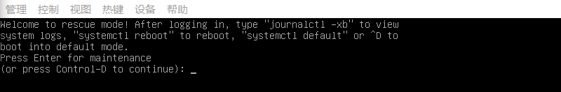
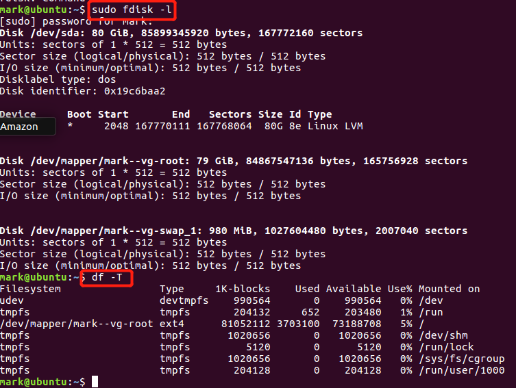
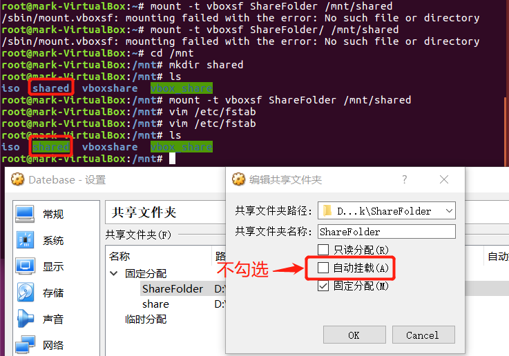

# chap0x03 开机自启动项管理

----------

## 实验环境
* Ubuntu 18.04 Server 64bit
* asciinema 2.0.1
* systemd 237
---
# 实验过程

## 命令篇
* `systemctl`

	```bash
	# 重启系统
	sudo systemctl reboot
	
	# 关闭系统，切断电源
	sudo systemctl poweroff
	
	# CPU停止工作
	sudo systemctl half
	
	# 暂停系统
	sudo systemctl suspend
	
	# 让系统进入冬眠状态
	sudo systemctl hibernate
	
	# 让系统进入交互式休眠状态
	sudo systemctl hybrid-sleep
	
	# 启动进入救援状态（单用户状态）
	sudo systemctl rescue
	```
* 启动进入救援状态（单用户状态）
	* 
* `systemd-analyze`
	* [学习视频](https://asciinema.org/a/TUC2G2Gzbg52Q1FBzG0ZcKtSv)
* `hostnamectl`+`loaclectl`+`loginctl`
	* [学习视频](https://asciinema.org/a/WC1zE0xcMTTuoFZRB4VORjUsS)
* `timedatectl`
	* [学习视频](https://asciinema.org/a/R2lKVmyI9PUWv0bMHCTQQwVk6)
	* 在执行`sudo timedatectl set-time YYYY-MM-DD`指令时遇到如下错误提醒，关闭系统自动同步时间的设置即可解决
		* `Failed to set time: Automatic time synchronization is enabled`
* `Unit`
	* [学习视频](https://asciinema.org/a/egiA8ew0vEtN0122FP4vm9JzE)
* `target`+`journalctl`
	* [学习视频](https://asciinema.org/a/ckg8oEOrTvrhI5SCCYnRtvHr9)
---
## 实战篇
* 以ssh.service为例，执行[参考资料](http://www.ruanyifeng.com/blog/2016/03/systemd-tutorial-part-two.html)中提到的操作
* [传送门](https://asciinema.org/a/5ReqzAAFfKISgJaGISqsRQfgE)
---
# 自查清单
* 如何添加一个用户并使其具备sudo执行程序的权限？

	```bash
	# 添加新用户
	sudo adduser <username>
	
	# 将用户添加到sudo组
	sudo usermod -aG sudo username
	
	# 切换到新建用户
	su - <username>
	
	# 执行只有sudo用户才能运行的指令，以验证是否具备sudo权限
	sudo ls -la /root
	```
* 如何将一个用户添加到一个用户组？

	```bash
	# -a(append),如果不添加-a，此用户将在其他组中被删除
	sudo usermod -a -G groupName userName
	```
* 如何查看当前系统的分区表和文件系统详细信息？
	
	```bash
	# 查看当前系统的分区表
	sudo fdisk -l
	
	# 查看文件系统信息
	df -T
	```
	

* 如何实现开机自动挂载Virtualbox的共享目录分区？

	```bash
	# 首先添加新的共享文件夹，注意不勾选"自动挂载"选项
	# 启动虚拟机(实验中使用ubuntu 16.04 Desktop 64bit)
	# 如果勾选自动挂载在执行下一步时会出现"/sbin/mount.vboxsf: mounting failed with the error: Protocol error"错误提示
	# 如果共享文件夹名称和挂载时的名称不相同也会出现上述错误，但是不能和虚拟机中的共享文件夹名称相同
	
	# 使用sudo权限,挂载共享文件夹
	mkdir /mnt/shared
	mount -t vboxsf ShareFolder /mnt/shared
	
	# 以下两步实现开机自动挂载
	# 向/etc/modules文件写入
	ShareFolder    /mnt/shared  vboxsf  defaults    0   0
	
	# 向/etc/modules文件写入
	vboxsf
	```
	

* 基于LVM（逻辑分卷管理）的分区如何实现动态扩容和缩减容量？

	```bash
	# 查看可用于分配的PE,Free PE字段
	pvdisplay
	
	# 查看系统中的逻辑卷及其相关信息(LV)
	lvscan
	
	# 选择逻辑卷进行扩容
	lvextend -L <逻辑卷增量> <逻辑卷全路径>
	
	# 逻辑卷减容
	lvreduce -L <逻辑卷减量> <逻辑卷全路径>
	```
* 如何通过systemd设置实现在网络连通时运行一个指定脚本，在网络断开时运行另一个脚本？(失败)
	* 编写如下配置文件后，服务启动失败

	```bash
	[Unit]
	Description=Test
	After=network.target
	After=network-online.target
	
	[Service]
	User=test
	ExecStart=/bin/bash /home/start.sh
	ExecStop=/bin/bash /home/stop.sh
	
	[Install]
	WantedBy=default.target
	```
* 如何通过systemd设置实现一个脚本在任何情况下被杀死之后会立即重新启动？实现杀不死？
	* 以`sshd.service`为例，进行测试，将`[Service]`区块的Restart字段值改为`always`之后，停止sshd服务后不会自动重启，因此还在继续试验。