# chap0x05 web服务器.md
## 实验环境

```bash
Ubuntu 18.04.1 LTS Server

sudo nginx -v
nginx version: nginx/1.14.0 (Ubuntu)

sudo verynginx -v
nginx version: openresty/1.9.15.1
```


---

## 实验过程
### step1 基本要求
* 向宿主机`C:\Windows\System32\drivers\etc\hosts`文件添加如下内容

	```bash
	# 表示将以下3个域名解析为Ubuntu server的IP地址
	192.168.53.4    wp.sec.cuc.edu.cn
	192.168.53.4    dvwa.sec.cuc.edu.cn
	192.168.53.4    vn.sec.cuc.edu.cn
	```
* VeryNginx[安装](https://github.com/alexazhou/VeryNginx)，安装过程参考[中文文档](https://github.com/alexazhou/VeryNginx/blob/master/readme_zh.md)以及[Trouble-Shooting](https://github.com/alexazhou/VeryNginx/wiki/Trouble-Shooting)

	```bash
	# 安装依赖项
	apt install libpcre3-dev libssl1.0-dev zlib1g-dev python3 unzip gcc make
	
	# 下载VeryNginx仓库
	wget https://github.com/alexazhou/VeryNginx/archive/master.zip
	unzip master.zip
	
	# 修改配置文件nginx.conf的第二行, 将执行程序的用户修改为www-data用户组
	cd VeryNginx-master/
	user www-data;
	
	# 安装VeryNginx
	python3 install.py install
	
	# 创建软链接
	ln -s /opt/verynginx/openresty/nginx/sbin/nginx /usr/sbin/verynginx
	
	# 检查配置语法是否正确
	sudo verynginx -t
	
	# 启动verynginx
	verynginx
	```
* 通过浏览器进入登陆页面,默认用户名/密码`verynginx/verynginx`
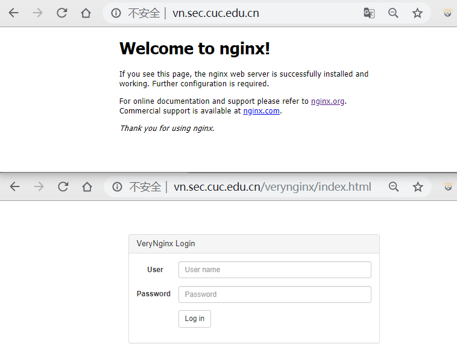
* 安装nginx

	``` bash
	# 停止VeryNginx
	verynginx -s stop
	
	# 下载安装nginx
	apt install nginx
	
	# 通过浏览器可以进入欢迎页面表示安装成功，停止nginx
	nginx -s stop
	```

* 安装WordPress

	```bash
	# WordPresss需要一个web服务器，一个数据库，以及PHP才能运行。
	# 安装MySQL和PHP
	sudo apt install mysql-server php7.2-fpm php7.2-mysql php7.2-gd
	
	# 进入MySQL，创建WordPress的数据库
	sudo mysql -u root -p
	mysql> CREATE USER 'wp_root'@'localhost' IDENTIFIED BY 'wp_pass';
	mysql> CREATE DATABASE wp_db;
	mysql> GRANT ALL ON wp_db.* TO 'wb_root'@'localhost';
	exit
	
	# 建立WordPress网站目录
	mkdir -p /var/www/wordpress/public/
	chown -R www-data:www-data /var/www/wordpress/public
	
	# 下载安装配置WordPress
	cd /tmp
	wget https://wordpress.org/wordpress-4.7.zip
	unzip wordpress-4.7.zip
	cp -r wordpress/ var/www/wordpress/public/
	cd /var/www/wordpress/public/
	
	# 修改配置文件使其正确访问mysql
	sed -i s/database_name_here/wp_db/ wp-config.php
	sed -i s/username_here/wp_root/ wp-config.php
	sed -i s/password_here/wp_pass/ wp-config.php
	echo "define('FS_METHOD', 'direct');" >> wp-config.php
	```
* 连接Nginx与WordPress

	```bash
	# 在/etc/nginx/sites-available/目录下新建wp.sec.cuc.edu.cn配置文件,写入配置内容
	server {
	    listen localhost:8080;
	    server_name wp.sec.cuc.edu.cn;
	
	    root /var/www/wordpress/public;
	    index index.php;
	
	    location / {
	        try_files \$uri \$uri/ /index.php?\$args;
	    }
	
	    location ~ \.php\$ {
	        include snippets/fastcgi-php.conf;
	        fastcgi_pass unix:/run/php/php7.2-fpm.sock;
	    }
	}
	
	# 创建软链接
	ln -s /etc/nginx/sites-available/wp.sec.cuc.edu.cn /etc/nginx/sites-enabled/
	rm /etc/nginx/sites-enabled/default
	
	# 检查配置语法是否正确
	nginx -t
	# output
	nginx: the configuration file /etc/nginx/nginx.conf syntax is ok
	nginx: configuration file /etc/nginx/nginx.conf test is successful
	
	# 运行Nginx
	nginx
	```
* 连接VeryNginx与Nginx
	* 登陆管理页面`wp.sec.cuc.edu.cn/verynginx/index.html`进入`config`页面
	* 上述过程如果出现404页面，通过`lsof -i:80`指令查看，可能是nginx占用了80端口，只需停止nginx服务，然后启动verynginx，再启动nginx即可
	* 进行如下配置并保存
	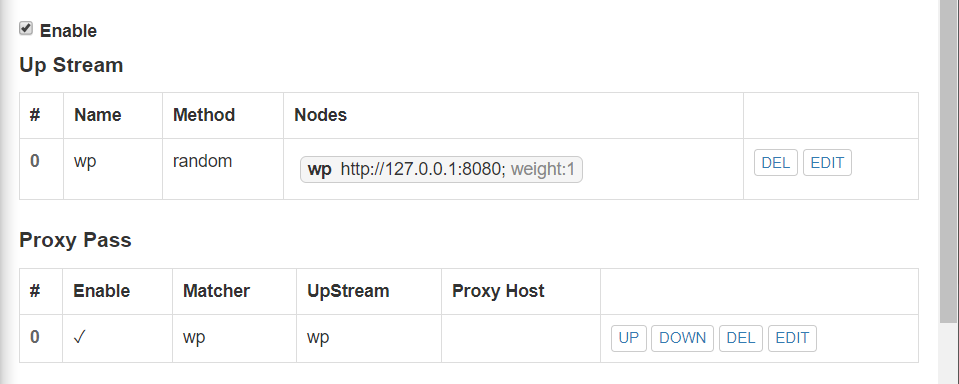
	* 添加如下Matcher
	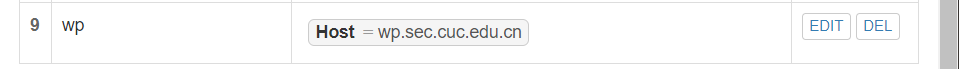
* 访问`http://wp.sec.cuc.edu.cn/wp-admin/install.php`出现如下界面，即为配置成功
	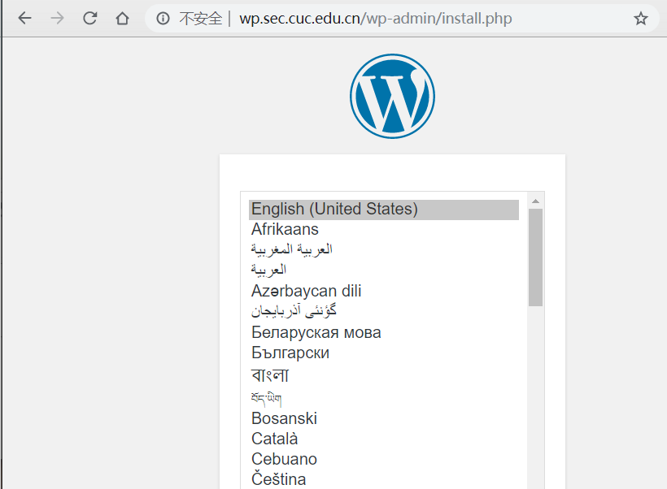
* 配置DVWA

	```bash
	方法与上一步配置过程类似
	# 创建网站目录
	mkdir -p /var/www/dvwa/public/
	chown -R www-data:www-data /var/www/dvwa/public
	
	# 下载解压
	cd /tmp
	wget https://github.com/ethicalhack3r/DVWA/archive/master.zip
	unzip master.zip
	cp -r DVWA-master/* /var/www/dvwa/public/
	cd /var/www/dvwa/public/
	
	# 创建相应的站点文件
	# 在/etc/nginx/sites-available/目录下新建dvwa.sec.cuc.edu.cn配置文件,写入配置内容
	server {
	    listen localhost:8000;
	    server_name dvwa.sec.cuc.edu.cn;
	
	    root /var/www/dvwa/public;
	    index index.php;
	
	    location / {
	        try_files \$uri \$uri/ /index.php?\$args;
	    }
	
	    location ~ \.php\$ {
	        include snippets/fastcgi-php.conf;
	        fastcgi_pass unix:/run/php/php7.2-fpm.sock;
	    }
	}
	
	# 创建软链接
	ln -s /etc/nginx/sites-available/dvwa.sec.cuc.edu.cn /etc/nginx/sites-enabled/
	
	# 检查配置语法是否正确
	nginx -t
	# output
	nginx: the configuration file /etc/nginx/nginx.conf syntax is ok
	nginx: configuration file /etc/nginx/nginx.conf test is successful
	
	重启Nginx
	nginx -s reload
	```
* 进入`http://dvwa.sec.cuc.edu.cn/verynginx/index.html`管理页面的`config`标签
	* 添加`Matcher`
	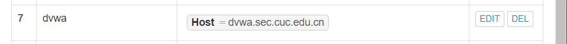
	* 添加`Up Stream`
	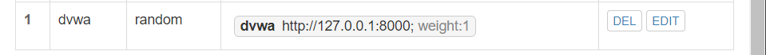
	* 添加`Proxy Pass`
	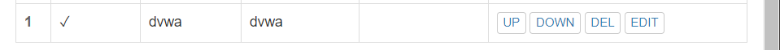
	* 访问`http://dvwa.sec.cuc.edu.cn/setup.php`出现如下界面表示配置成功
	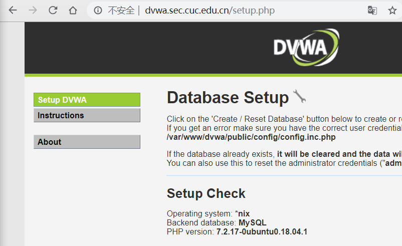
* 对WordPress启用HTTPS

	```bash
	# 使用OpenSSL生成自签名证书
	openssl req -x509 -newkey rsa:4096 -nodes -subj "/C=CN/ST=Beijing/L=Beijing/O=CUC/OU=SEC/CN=wp.sec.cuc.edu.cn" -keyout key.pem -out cert.pem -days 365
	
	# 将key.pem与cert.pem移到/etc/nginx/目录
	sudo mv key.pem /etc/nginx
	sudo mv cert.pem /etc/nginx
	
	# 修改VeryNginx的配置文件
	server {
	    listen 80;
	    listen 443 ssl;
	    ssl_certificate      /etc/nginx/cert.pem;
	    ssl_certificate_key  /etc/nginx/key.pem;
	
	    #this line shoud be include in every server block
	    include /opt/verynginx/verynginx/nginx_conf/in_server_block.conf;
	
	    location = / {
	        root   html;
	        index  index.html index.htm;
	    }
	}
	
	# 检查配置语法是否正确
	verynginx -t
	```
* 访问管理页面添加如下`Scheme Lock`
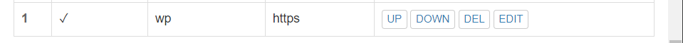
* 再次访问`wp.sec.cuc.edu.cn`会以https进行访问
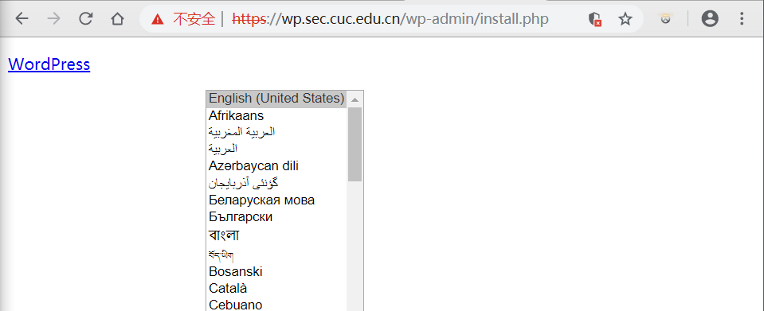

### step2 安全加固
* 使用IP地址方式均无法访问上述任意站点，并向访客展示自定义的友好错误提示信息页面-1
	* 添加`Matcher`规则
	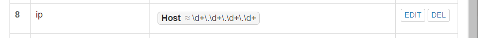
	* 添加`Response`规则
	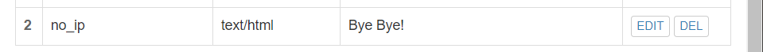
	* 添加`Filter`规则
	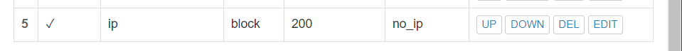
	* 使用ip地址访问，结果
	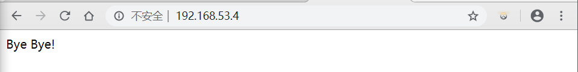
* Damn Vulnerable Web Application (DVWA)只允许白名单上的访客来源IP，其他来源的IP访问均向访客展示自定义的友好错误提示信息页面-2
 	* 添加`Matcher`规则
	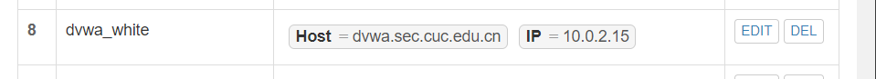
	* 添加`Response`规则
	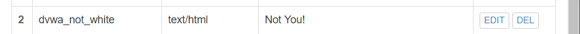
	* 添加`Filter`规则
	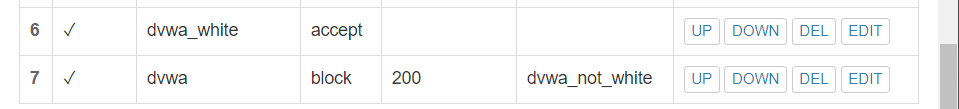
	* 白名单用户访问，结果
	
	* 非白名单用户访问，结果
	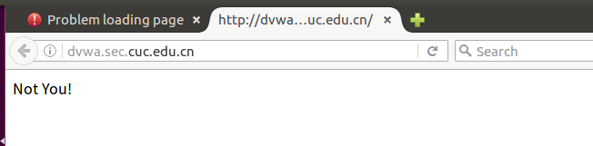
* 在不升级Wordpress版本的情况下，通过定制VeryNginx的访问控制策略规则，热修复WordPress < 4.7.1 - Username Enumeration
	* 添加`Matcher`规则
	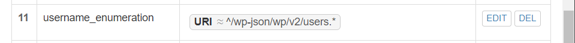
	* 添加`filter`规则
	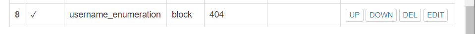
	* 结果
	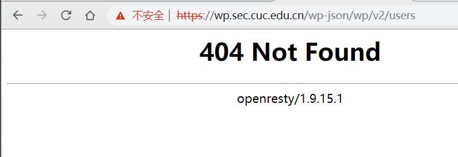

### step3 VERYNGINX配置要求
* VeryNginx的Web管理页面仅允许白名单上的访客来源IP，其他来源的IP访问均向访客展示自定义的友好错误提示信息页面-3
	* 添加`Matcher`规则
	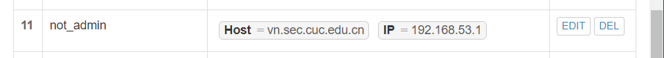
	* 添加`Response`规则
	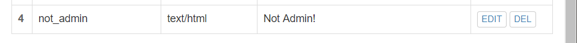
	* 添加`Filter`规则
	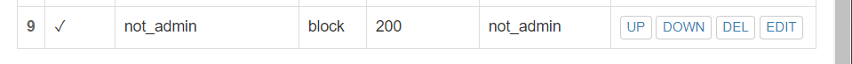
	* 结果
	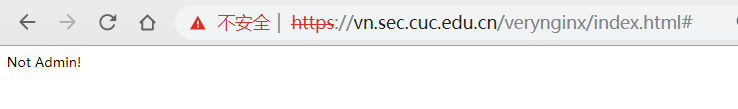
* 通过定制VeryNginx的访问控制策略规则实现：
	* 限制DVWA站点的单IP访问速率为每秒请求数 < 50
	* 限制Wordpress站点的单IP访问速率为每秒请求数 < 20
	* 超过访问频率限制的请求直接返回自定义错误提示信息页面-4
	* 配置方式
	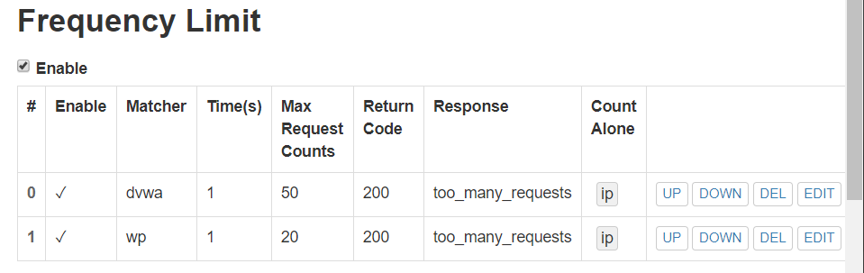
	* 结果
	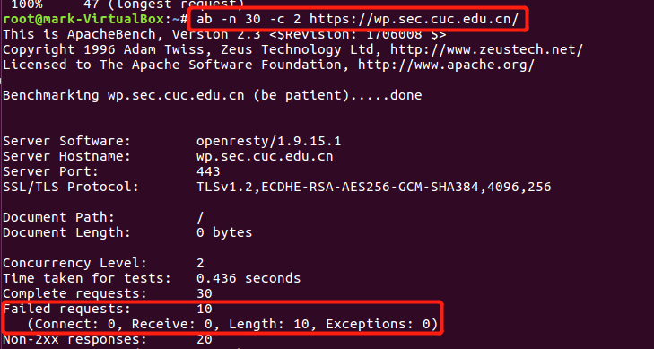
## 参考资料
[how-to-install-wordpress-with-lemp-on-ubuntu-18-04](https://www.digitalocean.com/community/tutorials/how-to-install-wordpress-with-lemp-on-ubuntu-18-04)
[how-to-install-linux-nginx-mysql-php-lemp-stack-ubuntu-18-04](https://www.digitalocean.com/community/tutorials/how-to-install-linux-nginx-mysql-php-lemp-stack-ubuntu-18-04)
[linux-2019-TheMasterOfMagic](https://github.com/CUCCS/linux-2019-TheMasterOfMagic/tree/chap0x05/chap0x05)
[what is the www-data user](https://askubuntu.com/questions/873839/what-is-the-www-data-user)